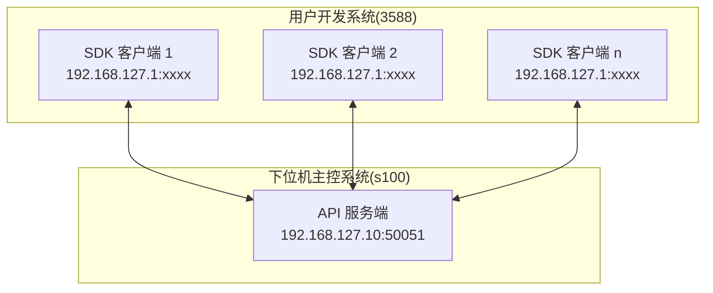

# Tangpa SDK 使用教程

## 1. 概述

### 1.1 基本介绍

Tangpa SDK 提供 `ControlApiClient` 和 `SystemApiClient` 两个客户端类，用于与 Tangpa 机器人进行通信和控制。
详细信息请参考 [API 接口定义及使用说明](docs/api_reference.md)。

| 客户端                | 职责               |
| ------------------ | ---------------- |
| `ControlApiClient` | 控制指令、数据订阅、UWB 配置 |
| `SystemApiClient`  | 系统诊断、机器人状态、电池电量  |

### 1.2 运行环境

- **操作系统：** Ubuntu 22.04.1
- **CPU 架构：** x86_64 或 aarch64
- **编译器：** GCC 11.4.0 或以上

### 1.3 构建环境

- **编译器：** GCC 11.4.0 或以上
- **CMake 版本：** 3.10.0 或以上

## 2. 快速开始

### 2.1 CMake 工程配置

SDK 提供了 CMake 包配置文件，通过 `find_package` 即可引入。

**项目目录结构：**

```
my_project/
  CMakeLists.txt        # 顶层 CMake
  main.cpp              # 源代码
```

**CMakeLists.txt：**

```cmake
cmake_minimum_required(VERSION 3.10.0)
project("my_project" VERSION 1.0.0 LANGUAGES CXX)

set(CMAKE_CXX_STANDARD 17)
set(CMAKE_CXX_STANDARD_REQUIRED ON)

# 将 SDK 根目录加入搜索路径（指向 SDK 包的顶级目录）
list(APPEND CMAKE_PREFIX_PATH "/path/to/tangpa_sdk_client")
find_package(tangpa_sdk_client REQUIRED)

add_executable(my_app main.cpp)
target_link_libraries(my_app PRIVATE tangpa_sdk_client::chric_tangpa_sdk_module_api)
```

### 2.2 示例代码

编辑示例代码 main.cpp

```cpp
#include "chric/robot/tangpa/tangpa_control_api.h"
#include "chric/robot/tangpa/tangpa_system_api.h"

using namespace humanoid_robot::sdk_client::robot;

int main() {
    auto control_client = std::make_unique<tangpa_control_api::ControlApiClient>();
    auto system_client = std::make_unique<tangpa_system_api::SystemApiClient>();

    Status status = control_client->Connect("localhost", 50051);
    if (!status) {
        std::cerr << "Failed to connect: " << status.message() << std::endl;
        return 1;
    }
    system_client->Connect("localhost", 50051);

    // 订阅 IMU 数据
    uint64_t sub_id = control_client->SubscribeImu(
        [](const std::shared_ptr<const tangpa_control_api::Imu>& imu) {
            std::cout << "Angular velocity: " << imu->angular_velocity().x() << std::endl;
        });

    std::this_thread::sleep_for(std::chrono::seconds(10));

    control_client->UnsubscribeImu(sub_id);
    control_client->Disconnect();

    return 0;
}
```

### 2.3 构建示例

```bash
cd my_project
mkdir build && cd build
cmake ..
make -j$(nproc)
```

> **关于运行时库路径**：SDK 的所有 .so 均内置 `$ORIGIN` 相对 RPATH，无需设置 `LD_LIBRARY_PATH`。将 SDK 目录整体移动到任意位置均可正常运行。

构建时，CMake 会为二进制注入 SDK 库的绝对路径 RUNPATH。如果不需要，请在 `find_package` 之前设置：

```cmake
set(CMAKE_SKIP_BUILD_RPATH ON)
```

### 2.4 运行示例

准备配置文件

```bash
cd my_project/build
mkdir -p config && cat > config/config.yaml <<'EOF'
grpc_client:
  connection:
    default_target: "192.168.127.10:50051"
    channel_ready_timeout_ms: 5000    # 通道就绪超时 (ms)
  channel:
    max_receive_mb: 100               # 最大接收消息大小 (MB)
    max_send_mb: 100                  # 最大发送消息大小 (MB)
EOF
```

运行程序

```bash
cd my_project/build
./my_app
```

## 3. 与机器人建立连接

创建客户端后，需要先与机器人的 API 服务端建立连接。

**连接流程：**


**镗钯EDU版本网络拓扑：**




>** 镗钯机器人 API 服务端默认地址为 `192.168.127.10:50051`，已配置为开机自启动。机器人完成自检后即可连接。

**连接方式：**

- **编程方式**：调用 `Connect(const std::string& host, int port)`或 `Connect(const std::string& target)`  方法直接指定地址，详见 [连接管理](docs/api_reference.md#1-连接管理)
- **配置文件方式**：源码中调用 `Connect()` 方法后，程序会加载 `config/config.yaml` 中的 `default_target` 自动连接，详见 [配置文件说明](#4-配置文件说明)

>** 两种连接方式同时使用时，优先使用编程方式连接。

## 4. 配置文件说明

SDK 通过 `config/config.yaml` 管理配置。`InterfacesClient` 构造时会自动加载并初始化日志系统。

### 4.1 gRPC 客户端

```yaml
grpc_client:
  connection:
    default_target: "192.168.1.100:50051"
    channel_ready_timeout_ms: 5000    # 通道就绪超时 (ms)
  channel:
    max_receive_mb: 100               # 最大接收消息大小 (MB)
    max_send_mb: 100                  # 最大发送消息大小 (MB)
```

### 4.2 日志

```yaml
logging:
  log_level: 3                        # 0=FATAL, 1=ERROR, 2=WARN, 3=INFO, 4=DEBUG
  log_dir: "SDK-Client/logs"          # 日志目录（相对可执行程序路径或绝对路径）
  max_file_size_mb: 3                 # 单文件最大大小 (MB)
  max_files_per_level: 10             # 每级别最多保留文件数
  enable_async: true                  # true=异步写, false=同步写
  enable_console_output: true         # true=控制台输出
  enable_simple_output: true          # true=简洁格式, false=详细格式（含文件、行号、函数名）
```

日志按级别分目录输出，文件命名格式为 `log_<pid>_<日期>_<时间>_<纳秒>.txt`：

```
SDK-Client/logs/
  fatal/
  error/
  warning/
  info/
  debug/
```

**编程方式控制（在创建任何 SDK 对象之前调用）：**

```cpp
#include "chric/common/Log/wlog.hpp"

// 使用自定义配置文件
WLogInitWithConfig("path/to/my_config.yaml");

// 或使用默认配置（DEBUG 级别，自动生成日志目录）
WLogInit();
```

## 4. 示例程序

SDK 包内 `examples/` 目录提供了可编译运行的示例代码。

**构建：**

```bash
cd tangpa_sdk_client
mkdir build && cd build
cmake ..
make -j$(nproc)
```

构建完成后二进制在 `bin/` 目录下。有 data 文件的示例（如 benchmark）会输出到独立子目录，同时自动复制其 `data/` 文件夹。CMake 会自动将 `config/` 复制到构建目录，无需手动操作。

**运行：**

```bash
# 无 data 依赖的示例（平铺在 bin/ 下）
./bin/CHRIC_SDKClient_test
./bin/system_test_gui

# 有 data 依赖的示例（独立子目录）
cd ./bin/tangpa_api_benchmark/ && ./CHRIC_SDKClient_benchmark
cd ./bin/control_test_gui/ && ./control_test_gui
```

| 示例        | 二进制                         | 运行路径                                                   |
| --------- | --------------------------- | ------------------------------------------------------ |
| 功能测试      | `CHRIC_SDKClient_test`      | `./bin/CHRIC_SDKClient_test`                           |
| 性能基准      | `CHRIC_SDKClient_benchmark` | `./bin/tangpa_api_benchmark/CHRIC_SDKClient_benchmark` |
| 控制API交互测试 | `control_test_gui`          | `./bin/control_test_gui/control_test_gui`              |
| 系统API交互测试 | `system_test_gui`           | `./bin/system_test_gui`                                |

> 运行前请确保已根据实际环境修改 `config/config.yaml` 中的 `default_target` 地址和端口。

## 5. 常见问题

### 连接失败

1. 检查机器人服务器是否运行
2. 检查地址和端口是否正确
3. 检查防火墙设置

### 订阅无回调

1. 检查服务端是否已启用对应数据流
2. 检查网络连接是否正常
